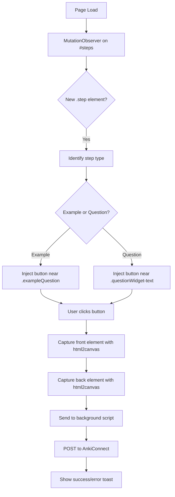

# Autobot – MathAcademy Flashcard Generator

Chrome extension that automatically creates Anki flashcards from MathAcademy lessons using AnkiConnect.

## Problem

MathAcademy teaches math through interactive lessons with worked examples and practice problems. Users want to create Anki flashcards from this content for spaced repetition, but:
- Manual copy-paste is tedious
- Math content (LaTeX/SVG) doesn't copy well as text
- No existing integration between MathAcademy and Anki

## Solution

A Chrome extension that:
1. Injects "Add to Anki" buttons on flashcard-able elements
2. Captures content as images (preserving math rendering)
3. Sends to Anki via AnkiConnect

---

## User Stories

### MVP (v1)
- **As a user**, I can click a button on any Example to create a flashcard with question as front, explanation as back
- **As a user**, I can click a button on any Question to create a flashcard with problem as front, explanation as back
- **As a user**, I can specify which Anki deck to use
- **As a user**, flashcards are automatically tagged with the lesson name

### Future (v2+)
- Auto-detect new content and prompt for flashcard creation
- Batch export entire lessons
- Custom front/back selection via drag

---

## Technical Architecture

### Stack
- **Framework**: [WXT](https://wxt.dev/) (modern browser extension framework)
- **Image Capture**: html2canvas (renders DOM elements to canvas)
- **Anki Integration**: AnkiConnect API (localhost:8765)

### Extension Structure
```
autobot/
├── wxt.config.ts
├── entrypoints/
│   ├── content.ts          # Injected into MathAcademy pages
│   ├── background.ts       # Handles AnkiConnect communication
│   └── popup/              # Extension popup (deck settings)
├── components/
│   └── FlashcardButton.ts  # Injected button component
└── utils/
    ├── capture.ts          # html2canvas wrapper
    ├── anki.ts             # AnkiConnect API client
    └── dom.ts              # DOM selectors for MathAcademy
```

### Content Script Flow


---

## DOM Targeting

### MathAcademy Lesson Structure
```
#steps
├── .step#step-{id}
│   ├── .tutorial (Introduction - skip for v1)
│   ├── .example
│   │   ├── .stepHeader
│   │   ├── .exampleQuestion      ← FRONT
│   │   └── .exampleExplanation   ← BACK
│   └── .questionWidget
│       ├── .questionWidget-text  ← FRONT (+ choices table)
│       └── .questionWidget-explanation ← BACK
└── ...more steps
```

### Selectors
| Target | Selector |
|--------|----------|
| All steps | `#steps .step` |
| Examples | `.step .example` |
| Questions | `.step .questionWidget` |
| Example front | `.exampleQuestion` |
| Example back | `.exampleExplanation` |
| Question front | `.questionWidget-text` |
| Question choices | `.questionWidget-choicesTable` |
| Question back | `.questionWidget-explanation` |
| Lesson name | Document title or `.lessonTitle` |

See `HTML-Ref.md` for detailed HTML structure examples.

---

## AnkiConnect Integration

### Required Endpoints
```typescript
// Check connection
{ action: "version" }

// List decks
{ action: "deckNames" }

// Add note with images
{
  action: "addNote",
  params: {
    note: {
      deckName: "MathAcademy",
      modelName: "Basic",
      fields: {
        Front: "",
        Back: ""
      },
      tags: ["mathacademy", "lesson-name-here"]
    }
  }
}
```

### Duplicate Detection
Before adding, check for existing notes:
```typescript
{
  action: "findNotes",
  params: {
    query: `tag:mathacademy "deck:MathAcademy" Front:*${contentHash}*`
  }
}
```

Alternatively, store a hash of captured content in a custom Anki field.

---

## UI Components

### Injected Button
- Small icon button (📝 or custom) positioned near each flashcard-able element
- On hover: "Add to Anki"
- On click: Shows loading spinner → success checkmark / error X

### Popup
- Deck selector dropdown (fetched from AnkiConnect)
- Connection status indicator
- Quick settings (tag prefix, model selection)

### Toast Notifications
- Success: "Flashcard added to [Deck Name]"
- Error: "AnkiConnect not running" / "Failed to capture"

---

## Image Capture Strategy

### Why html2canvas?
| Requirement | html2canvas |
|-------------|-------------|
| Long content (scrollable) | ✅ Captures full element |
| MathJax SVG | ✅ Renders SVGs correctly |
| Styling preserved | ✅ Computes styles |
| Client-side only | ✅ No server needed |

### Capture Settings
```typescript
html2canvas(element, {
  scale: 2,           // Retina quality
  useCORS: true,      // Handle external images
  backgroundColor: '#ffffff',
  logging: false
});
```

### Output Format
- PNG for best quality with math/diagrams
- Base64 encoded for Anki field embedding

---

## Data Flow

```
┌─────────────────────┐     ┌─────────────────────┐     ┌─────────────────────┐
│   Content Script    │     │  Background Script  │     │    AnkiConnect      │
│   (MathAcademy)     │     │                     │     │   (localhost:8765)  │
└─────────┬───────────┘     └──────────┬──────────┘     └──────────┬──────────┘
          │                            │                           │
          │ 1. User clicks button      │                           │
          │ 2. Capture images          │                           │
          │ 3. Send message ──────────►│                           │
          │                            │ 4. POST /addNote ────────►│
          │                            │                           │
          │                            │◄──── 5. Response ─────────│
          │◄──── 6. Show result ───────│                           │
          │                            │                           │
```

---

## Configuration

### User Settings (stored in chrome.storage)
```typescript
interface Settings {
  deckName: string;         // Default: "MathAcademy"
  tagPrefix: string;        // Default: "mathacademy"
  includeChoices: boolean;  // Include answer choices in question front
  imageScale: number;       // Default: 2
  ankiConnectUrl: string;   // Default: "http://localhost:8765"
}
```

---

## Edge Cases & Error Handling

| Scenario | Handling |
|----------|----------|
| AnkiConnect not running | Show error toast with setup instructions |
| Deck doesn't exist | Prompt to create or select existing |
| Element not fully loaded | Wait for MathJax rendering complete |
| Very long content | html2canvas handles; may take 1-2s |
| Duplicate flashcard | Skip and notify user |
| Network error | Retry once, then show error |

---

## Success Metrics

- Time to create flashcard: < 3 seconds
- Flashcard accuracy: Math renders correctly in Anki
- User friction: Single click to create

---

## Out of Scope (v1)

- Automatic flashcard suggestions
- Flashcard editing before save
- Sync with Anki mobile
- Other math learning platforms
- Tutorial content (introductions)

---

## Development Plan

### Phase 1: Foundation
- [ ] Initialize WXT project
- [ ] Create content script with MutationObserver
- [ ] Inject buttons on Examples and Questions

### Phase 2: Capture
- [ ] Integrate html2canvas
- [ ] Test capture on various MathAcademy content
- [ ] Handle MathJax SVG rendering

### Phase 3: AnkiConnect
- [ ] Implement AnkiConnect client
- [ ] Add note creation with images
- [ ] Implement duplicate detection

### Phase 4: Polish
- [ ] Popup UI for settings
- [ ] Toast notifications
- [ ] Error handling & edge cases
- [ ] Testing on real MathAcademy lessons

---

## Open Questions

1. **Button placement**: Inside the step header? Floating overlay? Corner of element?
2. **Capture timing**: Should we wait for user to reveal explanation before enabling button?
3. **Multiple cards per step**: Some steps have multiple sub-questions. Create one card or multiple?
